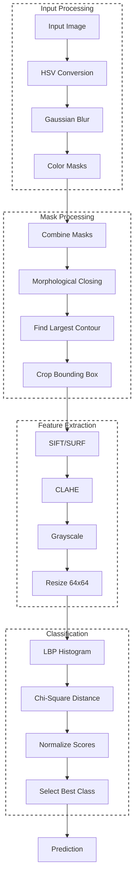
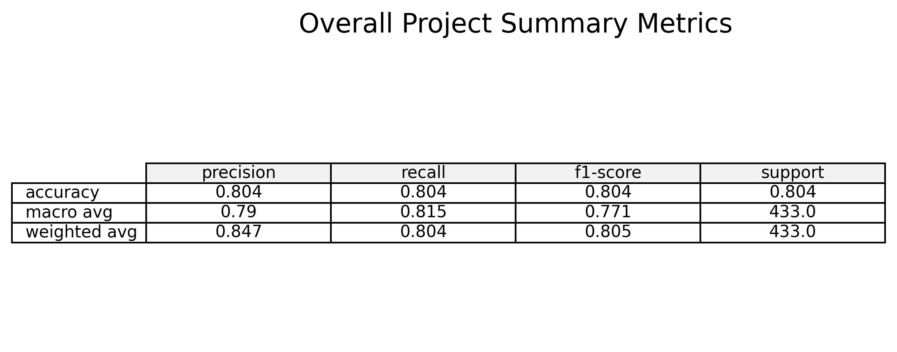

# CV Traffic Sign Recognition

A classical computer-vision pipeline for traffic sign detection and classification using color segmentation, preprocessing, and feature matching.
---
# Dataset

https://www.kaggle.com/datasets/tuanai/traffic-signs-dataset

---

## 📌 Pipeline Overview

1. **Color Segmentation (HSV)**
   - Convert image to HSV and apply red/blue/yellow thresholds.
   - Combine masks to isolate sign-colored regions.

2. **Mask Cleanup & Sign Isolation**
   - Morphological closing to fill gaps.
   - Find the largest contour and crop its bounding box.

3. **Preprocessing**
   - Resize to 64×64.
   - Convert to grayscale.
   - Apply **CLAHE** for contrast enhancement.

4. **Feature Extraction**
   - **SIFT/SURF** keypoints & descriptors.
   - **LBP** histogram for texture.

5. **Matching & Classification**
   - BFMatcher (L2) for SIFT/SURF.
   - Chi‑Square distance for LBP.
   - Normalize scores → pick best class.

---

## 🧭 Pipeline Diagram



---

## 📊 Metrics



---

## 🚀 Run the Streamlit Interface

```bash
streamlit run app.py
```

This launches a simple UI where you can upload a sign image and see the full classification pipeline.

---

## ✅ How to Run (CLI)

```bash
python matcher.py
```

---

## 🛠️ Stack

- Python  
- OpenCV  
- NumPy  
- Matplotlib  
- Streamlit  
